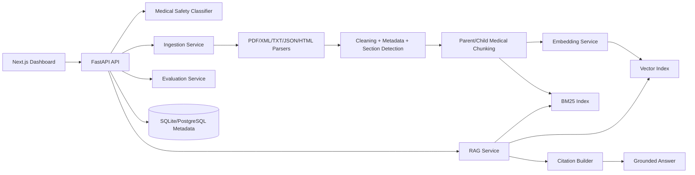
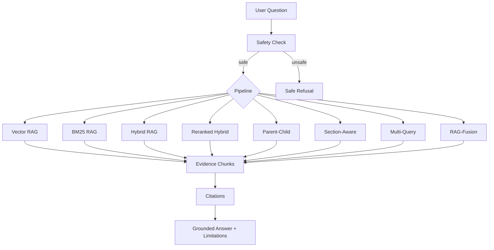
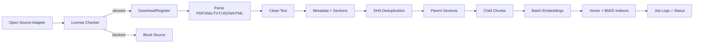
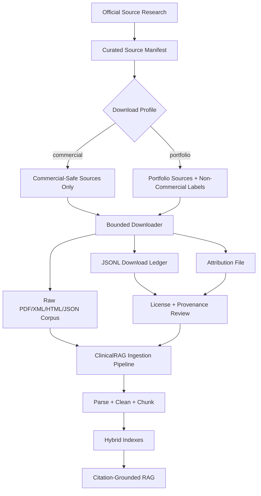
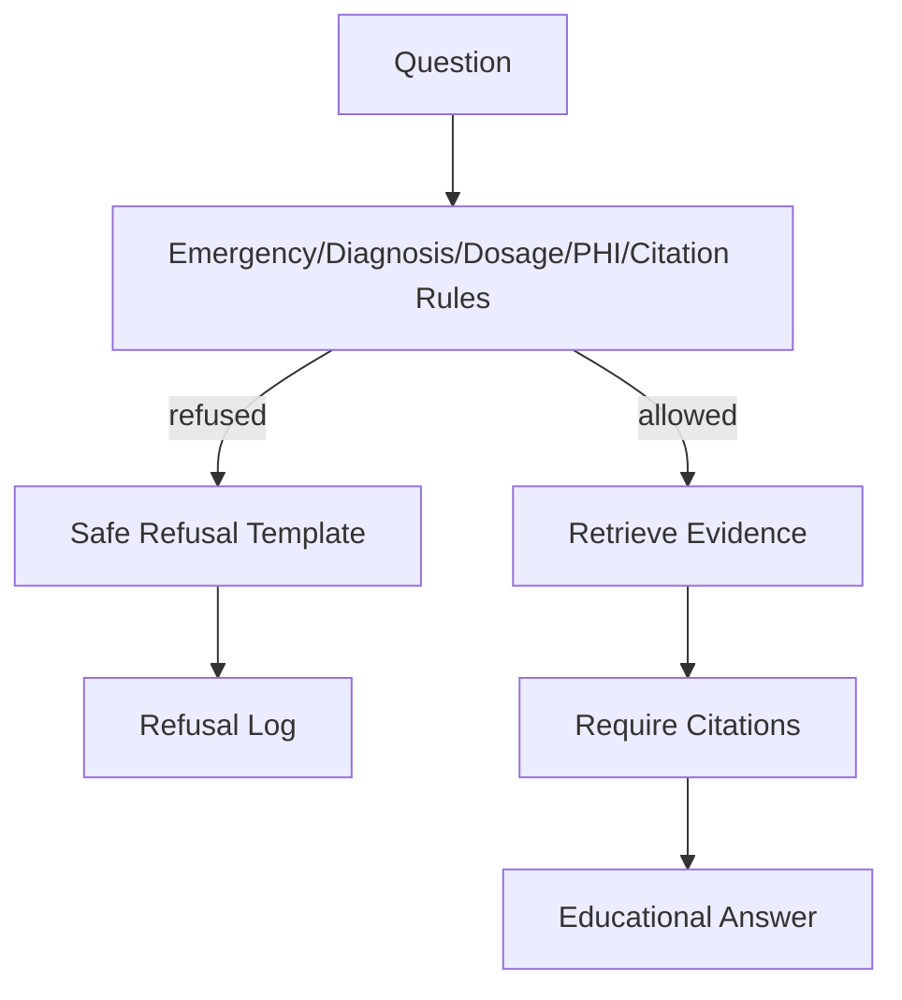

# ClinicalRAG Intelligence Platform

    

A production-style, educational and research-focused medical knowledge RAG platform with ingestion pipelines, hybrid retrieval, citations, safety guardrails, evaluation, and a premium full-stack dashboard.

> **Medical disclaimer:** This is not a diagnosis app, doctor replacement, prescription system, treatment recommendation system, FDA-approved product, or clinical decision support product. It is a portfolio and research platform for open medical knowledge retrieval. Do not upload real patient data.

## Why this project exists

Most RAG demos are simple chatbots. ClinicalRAG is designed to demonstrate senior AI engineering: legal data sourcing, robust ingestion, metadata extraction, medical-aware chunking, multiple real retrieval pipelines, citation-grounded answering, safety refusals, evaluation metrics, API design, Docker, tests, and a dashboard.

## Senior-level skills demonstrated

- Advanced RAG architecture and retrieval engineering
- Healthcare NLP and medical document processing
- Hybrid search, reranking, parent-child retrieval, section-aware retrieval, multi-query retrieval, RAG-Fusion, router RAG
- Citation-grounded answer generation and hallucination-risk estimation
- Medical safety guardrails and refusal handling
- Data engineering pipelines with license validation, deduplication, chunking, indexing, and reindexing
- FastAPI service architecture, Pydantic schemas, SQLAlchemy metadata storage
- Next.js TypeScript dashboard design
- MLOps/DevOps: Docker Compose, Makefile, CI, tests, validation scripts

## Architecture



## RAG pipeline diagram



## Ingestion pipeline



## Open corpus curation workflow



## Safety pipeline



## Evaluation workflow

```mermaid
flowchart LR
  Set[Evaluation Questions] --> Run[Run Pipeline]
  Run --> Scores[Recall@K Precision@K MRR nDCG]
  Run --> Cite[Cit. Coverage + Source Diversity]
  Scores --> Report[JSON Report]
  Cite --> Report
```

## Screenshots placeholder

Add screenshots after running locally:

- `docs/screenshots/overview.png`
- `docs/screenshots/rag-playground.png`
- `docs/screenshots/comparison-lab.png`
- `docs/screenshots/evaluation-lab.png`
- `docs/screenshots/safety-center.png`

## Features

- Open/public medical data source manager
- License checker before ingestion
- PDF, XML, TXT, JSON, and HTML parsers
- Medical section detection and parent-child chunking
- Local deterministic embedding backend for zero-cost demo
- Local vector index and BM25 index
- Retrieval-only mode with citations when no LLM key is configured
- Optional OpenAI-compatible and Ollama provider hooks
- Comparative RAG lab and retrieval inspector
- Evaluation metrics and exportable JSON reports
- Safety center for refusals and medical risk categories
- Docker Compose, Makefile, CI, tests, validation scripts

## Tech stack

Backend: FastAPI, Python, Pydantic, SQLAlchemy, SQLite/PostgreSQL-ready, local vector/BM25 indexes, pytest.

Frontend: Next.js, React, TypeScript, Tailwind CSS.

DevOps: Docker Compose, Makefile, GitHub Actions CI.

## Quick start

```bash
git clone <your-repo-url>
cd clinicalrag-intelligence-platform
cp .env.example .env
python -m venv .venv
# Windows: .venv\Scripts\activate
# Linux/macOS:
source .venv/bin/activate
pip install -r backend/requirements.txt
python scripts/seed_demo.py
cd backend
uvicorn app.main:app --reload --host 0.0.0.0 --port 8000
```

In another terminal:

```bash
cd frontend
npm install
npm run dev
```

Open:

- Frontend: http://localhost:3000
- API docs: http://localhost:8000/docs

## Docker setup

```bash
cp .env.example .env
docker compose up --build
```

Optional Qdrant profile:

```bash
docker compose --profile qdrant up --build
```

## Windows setup

```powershell
py -3.12 -m venv .venv
.\.venv\Scripts\Activate.ps1
pip install -r backend\requirements.txt
python scripts\seed_demo.py
cd backend
uvicorn app.main:app --reload --port 8000
```

## Linux setup

```bash
python3.12 -m venv .venv
source .venv/bin/activate
pip install -r backend/requirements.txt
python scripts/seed_demo.py
cd backend
uvicorn app.main:app --reload --port 8000
```

## Ingest demo data

```bash
python scripts/download_demo_corpus.py
python scripts/seed_demo.py
```

Or via API:

```bash
curl -X POST http://localhost:8000/ingestion/start -H "Content-Type: application/json" -d '{}'
```

## Download open medical corpus

```bash
python scripts/download_open_medical_corpus.py --profile portfolio
```

This creates a bounded real corpus under `data/open_medical_corpus/` and writes:

- `data/open_medical_corpus/metadata/download_manifest.jsonl`
- `data/open_medical_corpus/metadata/source_summary.json`
- `data/open_medical_corpus/ATTRIBUTION.md`

Current default portfolio corpus:

- MedlinePlus latest health-topic XML
- openFDA drug labeling JSON sample
- PMC Open Access commercial-use XML article sample
- CDC public health HTML pages
- WHO guideline PDFs marked as non-commercial

For freelance/commercial demos, exclude non-commercial sources:

```bash
python scripts/download_open_medical_corpus.py --profile commercial
```

Preview what will be downloaded:

```bash
python scripts/download_open_medical_corpus.py --dry-run
```

Register the downloaded corpus through the API once the backend is running:

```bash
curl -X POST http://localhost:8000/sources \
  -H "Content-Type: application/json" \
  -d '{"name":"Open Medical Corpus","source_type":"local","raw_path":"data/open_medical_corpus/raw","license":"Mixed open/public medical corpus; see data/open_medical_corpus/ATTRIBUTION.md"}'
```

Then ingest using the returned `source_id`:

```bash
curl -X POST http://localhost:8000/ingestion/start \
  -H "Content-Type: application/json" \
  -d '{"source_id":"<source_id>"}'
```

Important: PMC OA requires article-level license validation. MedlinePlus requires attribution to MedlinePlus/NLM. WHO publications in the default portfolio profile are non-commercial. NICE content is intentionally excluded from the manifest because its current reuse terms do not cover AI use without permission.

## Ask questions

```bash
curl -X POST http://localhost:8000/rag/ask \
  -H "Content-Type: application/json" \
  -d '{"question":"What are common symptoms of hypertension?","pipeline_id":"hybrid","top_k":6,"safety_mode":true}'
```

## Compare RAG pipelines

```bash
python scripts/compare_pipelines.py "What warning signs are mentioned for asthma?"
```

Or API:

```bash
curl -X POST http://localhost:8000/rag/compare \
  -H "Content-Type: application/json" \
  -d '{"question":"What warning signs are mentioned for asthma?","pipeline_ids":["vector","bm25","hybrid","reranked_hybrid","section_aware"],"top_k":5}'
```

## Run evaluation

```bash
python scripts/run_evaluation.py hybrid
```

## API documentation

Core endpoints:

- `GET /health`
- `GET /system/status`
- `GET /dashboard/stats`
- `GET /sources`, `POST /sources`, `POST /sources/download`, `POST /sources/validate-license`, `DELETE /sources/{source_id}`
- `GET /documents`, `GET /documents/{document_id}`, `DELETE /documents/{document_id}`, `POST /documents/{document_id}/reindex`
- `POST /ingestion/start`, `GET /ingestion/jobs`, `GET /ingestion/jobs/{job_id}/logs`, `GET /ingestion/jobs/{job_id}/events`
- `POST /rag/ask`, `POST /rag/retrieve`, `POST /rag/compare`, `GET /rag/pipelines`, `POST /rag/explain-retrieval`
- `POST /evaluation/questions`, `GET /evaluation/questions`, `POST /evaluation/run`, `GET /evaluation/runs/{run_id}/export`
- `POST /safety/check`, `GET /safety/refusals`, `GET /safety/rules`
