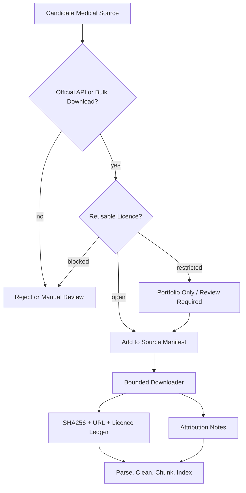

# Data Sources

ClinicalRAG uses a curated-source model instead of uncontrolled scraping. Every source should have an official download/API route, a reusable licence posture, attribution text, and a clear reason for inclusion.

The source manifest lives at `scripts/open_medical_sources.json`. The downloader writes a generated ledger to `data/open_medical_corpus/metadata/download_manifest.jsonl` and attribution notes to `data/open_medical_corpus/ATTRIBUTION.md`.

## Default Corpus Sources

| Source | Included | Commercial profile | Format | Licence posture |
| --- | --- | --- | --- | --- |
| MedlinePlus Health Topic XML | Yes | Yes | XML | Public-domain health topic summaries with MedlinePlus/NLM attribution. Avoid separately copyrighted A.D.A.M. and ASHP content. |
| openFDA drug labeling | Yes | Yes | JSON | Generally public domain / CC0 unless endpoint docs mark exceptions; cite FDA/openFDA and do not imply endorsement. |
| PMC Open Access commercial-use sample | Yes | Yes | XML | Article-level Creative Commons only. The downloader keeps CC0, CC BY, CC BY-SA, and CC BY-ND records and skips retracted records. |
| CDC public health pages | Yes | Yes | HTML | Most CDC/ATSDR content is public domain, but attribution/no-endorsement and third-party-content cautions apply. |
| WHO guideline PDFs | Portfolio only | No | PDF | CC BY-NC-SA 3.0 IGO; suitable for non-commercial portfolio demos, not default commercial freelance deployments. |
| NICE guidelines | No | No | Reference only | Excluded because current NICE reuse terms state AI use is not covered without permission. |

## Official References

- PMC Open Access Subset: https://pmc.ncbi.nlm.nih.gov/tools/openftlist/
- PMC AWS article datasets: https://pmc.ncbi.nlm.nih.gov/tools/pmcaws/
- MedlinePlus XML files: https://medlineplus.gov/xml.html
- MedlinePlus content reuse: https://medlineplus.gov/about/using/usingcontent/
- openFDA data licence: https://open.fda.gov/license/
- openFDA terms: https://open.fda.gov/terms/
- DailyMed SPL downloads: https://dailymed.nlm.nih.gov/dailymed/spl-resources.cfm
- CDC agency-materials policy: https://www.cdc.gov/other/agencymaterials.html
- WHO copyright/licensing: https://www.who.int/about/policies/publishing/copyright
- NICE open content licence: https://www.nice.org.uk/reusing-our-content/nice-uk-open-content-licence

## Download Commands

Portfolio corpus:

```bash
python scripts/download_open_medical_corpus.py --profile portfolio
```

Commercial-safe corpus:

```bash
python scripts/download_open_medical_corpus.py --profile commercial
```

Single-source example:

```bash
python scripts/download_open_medical_corpus.py --sources pmc_open_access_articles --limit 20
```

Dry run:

```bash
python scripts/download_open_medical_corpus.py --dry-run
```

## Workflow



## Operational Rules

- Do not scrape arbitrary medical websites.
- Prefer official APIs, official bulk files, or official public-domain pages.
- Store source URL, terms URL, licence text, attribution text, SHA256, and download timestamp.
- Keep large generated raw corpora out of git.
- Separate portfolio/non-commercial sources from commercial-safe sources.
- Preserve medical disclaimers: this project is educational and not clinical decision support.
