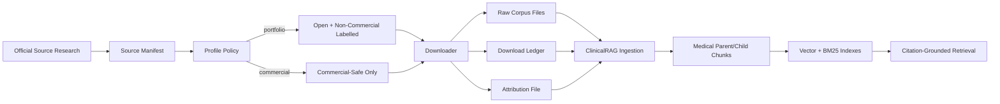

# Open Medical Corpus Workflow

This project includes a reproducible corpus downloader for open medical documents. It is intentionally bounded by default so the repository remains runnable on a laptop while still demonstrating professional data governance.

## Pipeline



## Generated Artifacts

- `data/open_medical_corpus/raw/`: downloaded XML, JSON, HTML, and PDF files.
- `data/open_medical_corpus/metadata/download_manifest.jsonl`: one provenance row per file.
- `data/open_medical_corpus/metadata/source_summary.json`: corpus count and size summary.
- `data/open_medical_corpus/ATTRIBUTION.md`: source-level attribution and licence notes.

## Current Download Snapshot

The latest verified run downloaded 38 files, about 36 MB total:

- 1 MedlinePlus health-topic XML file.
- 25 openFDA drug label JSON files.
- 5 PMC Open Access commercial-use XML articles.
- 4 CDC public health HTML pages.
- 3 WHO guideline PDFs for non-commercial portfolio use.

## Register And Ingest

Start the backend, register the local corpus, then ingest the returned source id:

```bash
curl -X POST http://localhost:8000/sources \
  -H "Content-Type: application/json" \
  -d '{"name":"Open Medical Corpus","source_type":"local","raw_path":"data/open_medical_corpus/raw","license":"Mixed open/public medical corpus; see data/open_medical_corpus/ATTRIBUTION.md"}'

curl -X POST http://localhost:8000/ingestion/start \
  -H "Content-Type: application/json" \
  -d '{"source_id":"<source_id>"}'
```

## Scale-Up Notes

- Increase `--limit` for openFDA and PMC once the small corpus is validated.
- Use `--profile commercial` when building a client-facing or freelance demo.
- Add new sources only through `scripts/open_medical_sources.json`.
- Keep the generated ledger with experiment records so answers can be traced back to source terms and exact file hashes.
